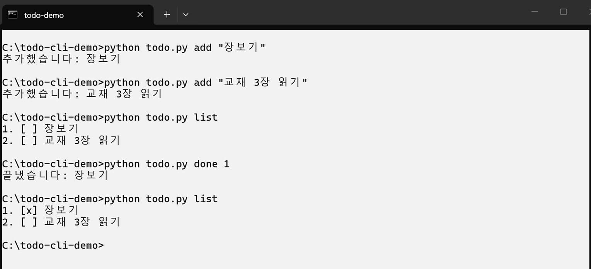

# todo — 한 줄로 쓰는 할 일 관리 도구

> 터미널에서 **한 줄**로 할 일을 적고, 끝내고, 지웁니다. 설치할 것은 파이썬 하나뿐입니다.


## 미리보기



## 할 수 있는 일

- **적기** — `add` 로 할 일을 한 줄 더합니다
- **보기** — `list` 로 번호와 끝냈는지 여부를 함께 봅니다
- **끝내기** — `done 번호` 로 끝난 표시를 합니다
- **지우기** — `remove 번호` 로 목록에서 뺍니다
- 할 일은 **같은 폴더의 `todo.json`** 에 저장되므로, 그 파일만 옮기면 다른 컴퓨터에서도 이어서 씁니다

## 설치

```bash
git clone https://github.com/SINGLE-COURSE-LECTURE/todo-cli-demo.git
cd todo-cli-demo
python todo.py list
```

자세한 단계와 막혔을 때의 대처는 **[설치 매뉴얼](docs/install.md)** 에 있습니다.

## 사용법

```bash
python todo.py add "장보기"
python todo.py list
python todo.py done 1
python todo.py remove 1
```

명령별 자세한 설명은 **[사용자 매뉴얼](docs/usage.md)** 에 있습니다.

## 폴더 구조

```text
todo-cli-demo/
├── README.md            입구 — 지금 보고 있는 문서
├── CHANGELOG.md         무엇이 언제 바뀌었나
├── CONTRIBUTING.md      도와주실 때의 규칙
├── CODE_OF_CONDUCT.md   함께 쓰는 곳에서의 약속
├── LICENSE              써도 되는 범위 (MIT)
├── todo.py              프로그램 본체
└── docs/
    ├── README.md        문서 목록
    ├── install.md       설치 매뉴얼
    ├── usage.md         사용자 매뉴얼
    ├── architecture.md  동작 구조
    └── assets/          문서에 쓰는 그림
```

## 라이선스

[MIT](LICENSE) — 마음대로 쓰고 고치고 배포해도 됩니다. 저작권 표시만 남겨 주세요.

---

**문서 사이트** → <https://single-course-lecture.github.io/todo-cli-demo/>
**변경 이력** → [CHANGELOG.md](CHANGELOG.md) · **기여 안내** → [CONTRIBUTING.md](CONTRIBUTING.md)
