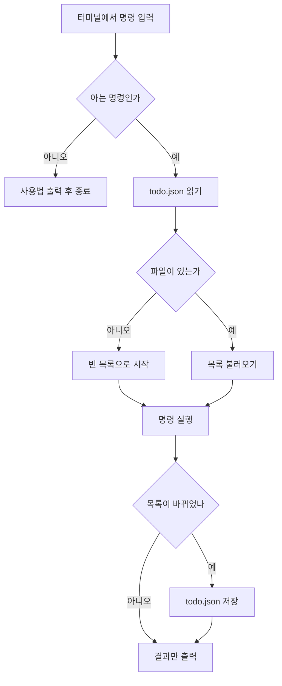
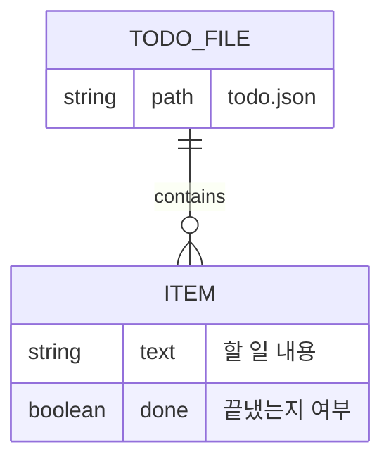

# 동작 구조

`todo` 가 안에서 무슨 일을 하는지 그림으로 설명합니다. **고치려는 분**을 위한 문서입니다.

## 명령 하나가 처리되는 흐름



## 저장되는 자료의 모양



실제 파일은 이렇게 생겼습니다.

```json
[
  { "text": "장보기", "done": true },
  { "text": "교재 3장 읽기", "done": false }
]
```

## 함수 한눈에 보기

| 함수 | 하는 일 |
|---|---|
| `load()` | `todo.json` 을 읽어 목록으로 만든다. 파일이 없으면 빈 목록 |
| `save(items)` | 목록을 `todo.json` 에 다시 쓴다 |
| `cmd_add(args)` | 목록 끝에 하나 더한다 |
| `cmd_list(args)` | 번호를 붙여 출력한다 |
| `pick(items, args)` | 사용자가 준 번호를 **0 부터 세는 자리**로 바꾼다 |
| `cmd_done(args)` | 그 자리의 `done` 을 참으로 바꾼다 |
| `cmd_remove(args)` | 그 자리의 항목을 뺀다 |

## 고칠 때 주의할 곳

- **번호는 사람 기준 1 부터**입니다. `pick()` 이 1 을 빼 주므로, 새 명령을 만들 때도 이 함수를 쓰세요
- `save()` 는 **통째로 다시 씁니다.** 항목이 아주 많아지면 느려집니다
- 파일 경로는 **프로그램이 있는 폴더 기준**입니다. 터미널의 현재 폴더와 무관합니다

## 다음에 볼 문서

- [기여 안내](../CONTRIBUTING.md) — 고친 것을 보내는 방법
